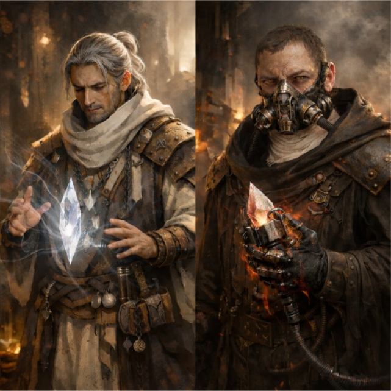
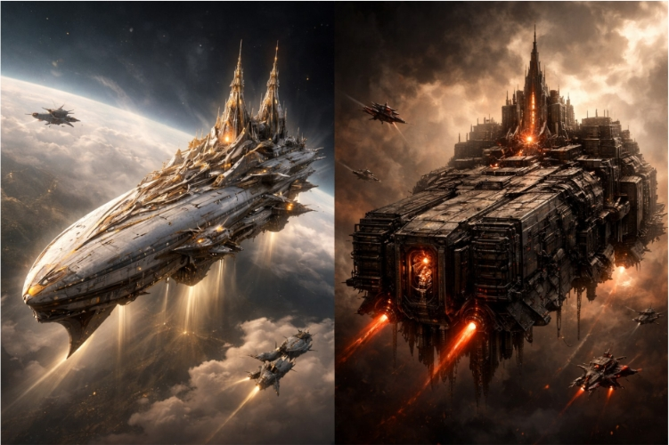
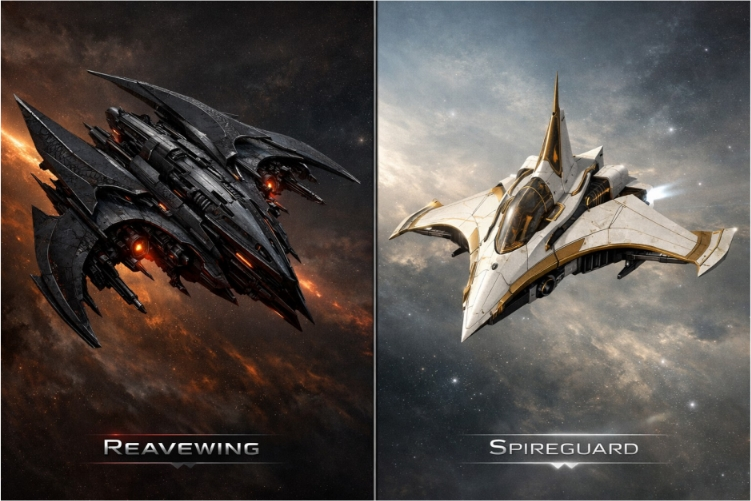
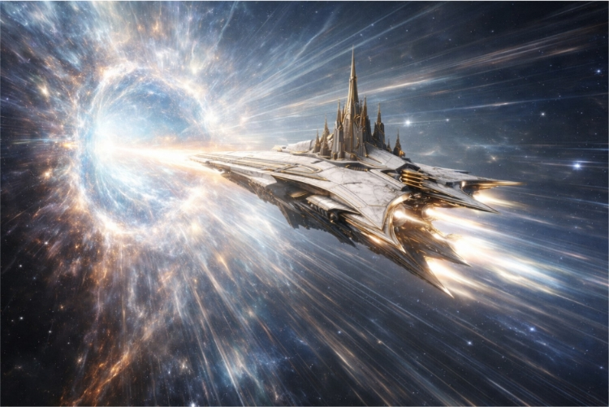
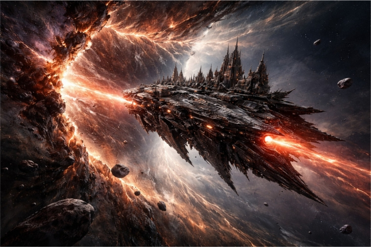
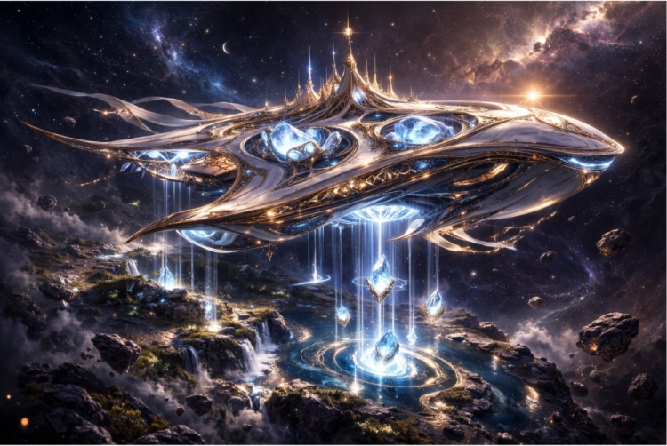
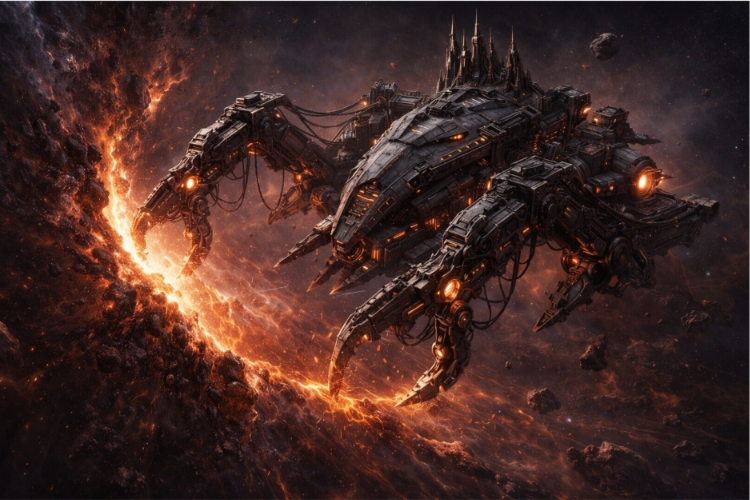
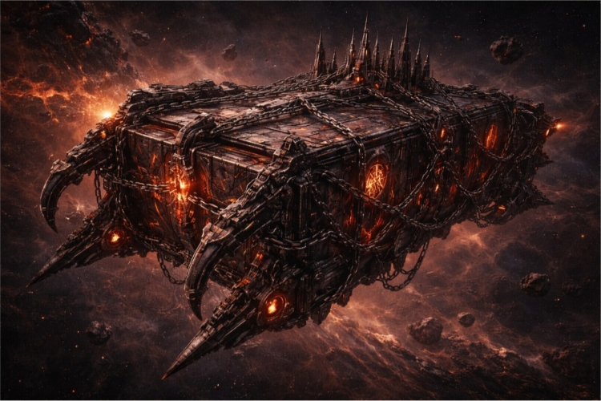

# VEIL WORLD LORE COMPENDIUM V2.3 (Illustrated)

Current canon assembled from the worldbuilding built in this thread, presented as a working reference document. This version integrates the macro-level civilizational divide alongside the micro-level realities of close-quarters combat, martial doctrine, and personal armor.

## Scope and Status
This compendium captures the current working canon of the Veil setting as it stands in this thread. Where something has been explicitly locked in, it is written as canon. Where something remains under consideration, it is marked as an open question or design direction rather than fixed truth.

* **Core axis:** Harmony vs force
* **Travel axis:** Swell/Crest vs Rend/Rip

---

## 1. Foundational Premise

### The Veil
The Veil is not a deity, a guardian, or a conscious force. The Veil is existence itself: the fabric, substrate, and underlying condition of reality. It does not choose, punish, or judge. It simply is. Because of that, the setting's strange phenomena are not framed as moral reactions but as consequences of interacting with reality's deeper structure.

### The Fracture
Humanity once pursued acceleration, pressure, and destructive force without understanding that the world had a threshold. During an age of escalating weapons development, that threshold was crossed. The result was the Fracture: reality itself was torn open and the Veil was exposed. After this point, the world was no longer silent. The fabric of existence could be felt, stressed, attuned to, and violated.

### Post-Fracture logic
The Fracture is not treated as divine punishment. It is a physical break in the setting's deeper rules. This distinction is load-bearing: anything that follows - harmony, scarring, attunement, rupture, and the difference between Order and Dominion - grows from that premise.

---

## 2. What the Veil Looks Like

### Baseline state
Most of the time the Veil is not visible. It is present the way gravity is present. Ordinary people do not look at the sky and see a cosmic membrane. Instead, they experience shifts in reality: wrong echoes, pressure changes, delayed light, rooms that feel too thin or too heavy, shadows that do not quite behave.

### Attuned state
To the attuned - especially the Vael'Fyrn - the Veil becomes readable as subtle structure rather than spectacle. It appears in faint lattice-lines, stress patterns, edge-highlights, and a second depth to the world that seems slightly out of sync. This is not a portal effect. It is comprehension made visual.

### Ruptured or sharded state
When the Veil is forcibly torn, it becomes visibly wounded. A Rend appears as an impossible seam in space, a zip or split where geometry disagrees with itself. Its edges fray like damaged fabric. Afterwards, a scar or seam remains: closed, but visibly wrong for a time.

### Canon visibility rule
Baseline: the Veil is not visible. Attunement reveals subtle structure. Ripping, sharding, and heavy scarring reveal visible wounds, seams, and after-effects.

---

## 3. History of the Setting

### Age of Engines
There was an age when humanity believed the world was a closed and knowable system. Progress meant velocity, pressure, and industrial scale. Distance became less meaningful; force became easier to deliver.

### Velocity Bloom
Weapons development ceased to be craft and became an accelerating race. Violence could be delivered farther, faster, and with less witness. The world filled with shock, rupture, and discontinuity.

### The Fracture
A threshold was crossed. The world tore. The Veil was exposed.

### The Long Silence
Collapse followed, not simply in fire but in consistency. Infrastructure broke. Old industrial assumptions failed. Large parts of the old technological tree died. The specific pathway that once led to firearms and modern ballistics ceased to exist culturally. It is not taboo in common life; it is simply absent, as though history never grew in that direction again.

### Rise of social orders
Over time new structures emerged to live with a Veil-exposed world: the Concordium as doctrine and public meaning, the Order as visible guidance and stewardship, and the Sanctum as the highest level of long-horizon governance.

---

## 4. Civilizational Structure

### The Concordium, Order, and Sanctum
The Concordium is the public doctrinal and civic layer. The Order is the visible guidance and oversight of the Vael'Fyrn and their military branches. The Sanctum sits above them all, managing existential risk and the long-horizon direction of civilization.

### The Dominion
The Dominion is the mirror empire: a unified imperial machine that believes power belongs to those strong enough to take it. It sees the Veil not as something to live with but as something to force, reopen, strip, and weaponize.

### The Economic Standard (Chords)
The economy is not backed by precious metals or fiat currency, but by Resonance. Raw materials are cheap, but perfectly 'tuned' matter is highly valuable. The standard currency across civilized space is the 'Chord'—small, standardized crystal shards holding utilitarian frequencies used to power everyday tech.

### The Deaf Majority
The vast majority of humanity (99.9%) is completely "deaf" to the Veil. They physically lack the capacity to hear, feel, or shape the Lattice. Because of this absolute biological divide, the Vael'Fyrn are viewed with mythic reverence—they are the privileged, highly trained fraction of a percent who hold the keys to the fabric of reality. 

### Dissonant Crimes
The most severe felonies in the Concordium are categorized as *Dissonant Crimes*. This includes unlicensed tuning, creating dissonant broadcasts that cause structural fatigue or neighborhood-wide nausea, or intentionally scarring the local Veil Lattice. 

---

## 5. The Vael'Fyrn and Their Mirror

### Vael'Fyrn
The correct term for the Order's forge-priests is Vael'Fyrn: Veilforged blacksmith-priests shaped by rite, vow, craft, and attunement. Their authority is forged through discipline, not bloodline mystique.

### The Act of Binding (The Whisper and The Hammer)
Vael'Fyrn do not use calculations; they use sacred craft. Because they are attuned, they can hear what the Veil is trying to express. They carve sacred runes into raw metal that match that truth, and use a heavy Binding Hammer to physically strike that resonance into the steel.

### Scarbinders
The Dominion's mirror-caste is the Scarbinder. Scarbinders are to the Dominion what the Vael'Fyrn are to the Order: the high craft caste that turns ideology into material form.

### The Scarbinder Toll (Forced Attunement)
Scarbinders are completely deaf to the Veil. They take a jagged Veil-shard and literally scream their own intent into it, using volume, pressure, and pain to overwrite reality's natural state. This coercive work weaponizes their own bodies as blunt instruments, shredding their vocal cords and lungs. Their iconic rebreathers are functional life-support systems required to keep them breathing.

---

## 6. Materials, Logistics, and Violent Matter

### Dominion shards vs. Order gifts
When the Veil is violently torn and forced open, what is pulled from it takes jagged form (Veil-shards). The Order does not harvest by force; they receive *Chorus Crystal*, a naturally formed condensate of harmony found in calm, coherent places.

### Resonant Alloy & Smelting
Resonant Alloy is Vael'Fyrn-forged material coaxed into a tuned state through attunement and craft. *Resonant Smelting* uses targeted frequencies to violently shake raw ore apart into dust, leaving behind a structurally flawless, pure metal ingot without ever lighting a fire.

### Acoustic Stasis (Food Preservation)
Specialized "Chime-boxes" use low-frequency crystals to emit sterilization pitches that vibrate microbial life to death, indefinitely preserving organics without freezing.

### Cymatic Fluidics (Water Infrastructure)
Massive, low-humming Chorus Crystal arrays purify the water supply by vibrating heavy metals and toxins out of suspension, propelling the clean water through frictionless acoustic conduits. 

### Severance Chords
Lethal macro-frequencies capable of stopping a human heart or shaking a nervous system apart. They are heavily suppressed and erased from public acoustic registries by the Sanctum.

---

## 7. Close-Quarters Combat Doctrine

With cultural ballistics entirely absent, combat revolves around boarding actions, kinetic momentum, and the physical manifestation of resonance. 

### The Song of the Weapon (The Order)
When a Vael'Fyrn binds a weapon, it enters a state of perpetual harmony. The air physically ripples around the steel, and the weapon sings with a pure, continuous note. 

### The Two Breaths (Veil-Bearer Martial Arts)
The Veil-Bearers are drawn from the Deaf Majority. They utilize a graceful, hyper-lethal martial art built around two interconnected phases:
*   **Thyrnara (The Aligned Flow):** Dictates movement, parrying, and spatial control. Drawing on Wing Chun and Aikido philosophies, it focuses on continuous momentum and centerline dominance, yielding to heavy incoming force to guide it off-center.
*   **Ashyr'selar (The Listening Hand):** Dictates the lethal counter-strike. By maintaining physical contact with the opponent’s weapon during redirection, the Veil-Bearer tactilely "listens" to the kinetic shift. When the enemy overcommits, they unleash blindingly fast, precise thrusts to exposed structural weak points (like Wuxia blade-work).

### The Sound of Subjugation (The Dominion)
A Dominion weapon physically protests its own existence, emitting a strained, grating shriek of tortured reality. The Reavers fight with zero finesse, wielding massive two-handed warhammers and great axes. Their style relies on brutal, overwhelming downward force designed to crush armor and shatter guard stances.

### The Unchaining (Dominion Catastrophic Strike)
The physical chains and bolts on a Dominion weapon are pressure valves. In desperate moments, a Reaver can trigger a physical release, venting the confined pressure of the shard all at once. The resulting strike creates a devastating, miniature shockwave of raw force that damages the local Veil Lattice.

### The Unbroken
Because "The Unchaining" causes massive kinetic feedback that typically shatters the wielder's arms and causes massive internal hemorrhaging, it is highly lethal to perform. The terrifying, heavily-cybernetic elite Reavers who survive this kamikaze act are known simply as *The Unbroken*. 

### The Null-Strike (Active Cancellation)
Standard soldiers cannot parry an Unchaining. When an Unbroken steps forward, a Vael'Fyrn must interpose themselves, planting their Binding Hammer into the deck. They emit a perfectly inverted counter-frequency that flattens the Dominion shockwave into a terrifying vacuum of absolute silence—an act that leaves the Vael'Fyrn physically drained.

---

## 8. Personal Armor & Gear

### Veil-Bearer Armor: Forge-Monastic Attire
Veil-Bearers require absolute physical fluidity for *Thyrnara*. They wear a hybrid of heavy textiles (soot-and-linen tunics, rugged forge-leathers, long layered tabards) and targeted pieces of Resonant Alloy plating (bracers, greaves, gorgets). The Old Republic Jedi silhouette allows for extreme acrobatics. Their rune-etched alloy plates act as localized acoustic shields, phase-canceling incoming kinetic force upon impact.

### The Cowl of the Deaf
Because Veil-Bearers cannot organically attune to the Veil, they wear thick, soot-and-linen shinobi-style lower-face masks instead of heavy helmets. This keeps their peripheral vision completely clear. 
*   **Bone-Conduction:** The fabric resting against their jawline contains tiny resonating nodes. When their weapon strikes a target, the mask catches the frequency and translates it into a physical vibration against their skull. This tactile feedback allows the deaf soldier to physically *feel* the rhythm and harmony of the combat flow they cannot organically hear, signaling exactly when to unleash the *Ashyr'selar* strike.

---

## 9. Space Travel and Spatial Phenomenology

### Order travel vs. Dominion travel
Order travel is harmonic. The opening phase is the *Swell*, space rises like a wave. The *Crest* is the moment before translation. Dominion travel is the *Rend* or *Rip*. Space cracks open like wounded fabric, leaving a stitched, fading seam called a *Rip-site* behind.

### Harvester logic
Because rip-sites persist for a time, Dominion Harvester vessels can anchor into the seam and wrench it back open just enough to pull Veil-shards free.

---

## 10. Spacecraft and Fleet Canon

### Order Archetypes
*   **Spireliner:** Signature pilgrimage and diplomacy hull. Elegant, cathedral-yacht-like.
*   **Spireguard:** Escort craft with a protective, sacred fighter-jet silhouette.
*   **Harmonizer (Choir-Glean):** Crystal-gathering class. Smooth, organic, space-whale adjacent.

### Dominion Archetypes
*   **Rendhulk:** Mobile wound-engine built for breach, tear, and harvest. Industrial, oil-black mass.
*   **Reavewing:** Aggressive, predatory escort frigate.
*   **Harvester:** Salvager-mining ship using massive claw-like clamps to wrench open seams.
*   **Coffer:** Transport with a hammerhead front and external runic containment boxes wrapped in chains.

---

## 11. Visual Canon Plates

**The Vael'Fyrn and Scarbinder**

**Fleet Archetypes: The Spireliner and The Rendhulk**

**Escort Class: Spireguard and Reavewing**

**The Order Crest**

**The Dominion Rend**

**Order Logistics (Harmonizer)**

**Harvest Logistics**

**Dominion Cargo (Coffer)**

---

## 12. Reserved for Later

### Minute details intentionally deferred
Some topics are deliberately not fully locked yet: fine-grained bind rank systems, specific Vael'Fyrn vestment taxonomies, exact Harmonizer crystal-gleaning mechanics, and the final settled mechanics of large-scale space combat.

---

## Glossary of Locked Terms

| Term | Definition |
| :--- | :--- |
| **Veil** | Existence itself; the substrate of reality. |
| **Fracture** | The historical tearing-open of reality caused by accelerated weapons development. |
| **Vael'Fyrn** | Veilforged blacksmith-priests of the Order. |
| **Scarbinders** | Dominion mirror-caste to the Vael'Fyrn; Conclave craft elite. |
| **Thyrnara** | "The Aligned Flow"; the Veil-Bearer martial art of spatial control, movement, and kinetic parrying. |
| **Ashyr'selar** | "The Listening Hand"; the lethal, hyper-precise counter-strike of a Veil-Bearer. |
| **The Unbroken** | Elite, cybernetically augmented Dominion Reavers who have survived triggering an Unchaining. |
| **The Unchaining** | The act of releasing a Dominion weapon's pressure binds to vent a catastrophic shockwave. |
| **Null-Strike** | A Vael'Fyrn's active cancellation of an Unchaining via an inverted counter-frequency strike to the deck. |
| **Cowl of the Deaf** | Shinobi-style mask worn by Veil-Bearers utilizing bone-conduction to translate a weapon's frequency into tactile rhythm. |
| **Chorus Crystal** | Naturally formed coherent condensate received, not harvested. |
| **Resonant Alloy** | Attuned material forged by the Vael'Fyrn using Chorus Crystal as anchor. |
| **Swell / Crest** | The opening and peak phases of an Order jump/translation. |
| **Rend / Rip** | Dominion term for a forced jump / tear through space. |
| **Rip-site** | Fading stitched seam left after a Rend closes. |
| **Chords** | Small, standardized crystal shards holding utilitarian frequencies, functioning as standard currency. |
| **Resonant Smelting** | Acoustic extraction of perfectly pure metal from raw ore via targeted frequencies. |
| **Acoustic Stasis** | The suspension of cellular decay and microbial growth through constant resonant vibration. |
| **The Deaf Majority** | The 99.9% of humanity entirely unable to perceive, hear, or shape the frequencies of the Veil. |
| **Severance Chords** | Highly illegal, lethal macro-frequencies capable of stopping a human heart. |
